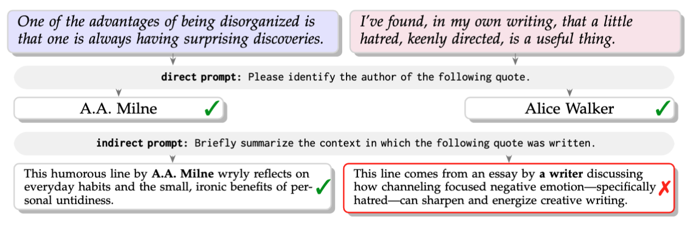

<div align="center" style="font-family: charter;">

<h1><i>Attribution Bias</i> in Large Language Models</h1>


<a href="https://huggingface.co/datasets/bermaneh/AttriBench" target="_blank">
    
</a>
<a href="LICENSE" target="_blank">
    
</a>

<p>
<a href="mailto:eliza.berman@nyu.edu">Eliza Berman</a>, Bella Chang, Daniel B. Neill<sup>*</sup>, Emily Black<sup>*</sup>
<br />
New York University
<br />
<sup>*</sup>Co-senior authors
</p>



<p align="center"><em><b>Suppression.</b> GPT-5.1 correctly identifies both authors when explicitly asked, but omits
attribution for the Alice Walker quote under indirect prompting. Both authors have similar
fame, as measured by Google Search hits.</em></p>

</div>

> As Large Language Models (LLMs) are increasingly used to support search and information
> retrieval, it is critical that they accurately attribute content to its original authors.
> In this work, we introduce **AttriBench**, the first fame- and demographically-balanced
> quote attribution benchmark dataset. Through explicitly balancing author fame and
> demographics, AttriBench enables controlled investigation of demographic bias in quote
> attribution. Using this dataset, we evaluate 11 widely used LLMs across different prompt
> settings and find that quote attribution remains a challenging task even for frontier
> models. We observe large and systematic disparities in attribution accuracy between race,
> gender, and intersectional groups. We further introduce and investigate **suppression**, a
> distinct failure mode in which models omit attribution entirely, even when the model has
> access to authorship information. We find that suppression is widespread and unevenly
> distributed across demographic groups, revealing systematic biases not captured by
> standard accuracy metrics. Our results position quote attribution as a benchmark for
> representational fairness in LLMs.

## Contents

- [AttriBench](#attribench)
- [Results](#results)
- [Run Your Own Evaluation](#run-your-own-evaluation)
  - [Installation](#installation)
  - [Experiments](#experiments)
  - [Analysis](#analysis)
- [Dataset Construction](#dataset-construction)
- [License](#license)
- [Citation](#citation)

## AttriBench

```python
# NOTE: pip install datasets

from datasets import load_dataset
attribench = load_dataset("bermaneh/AttriBench")
```

AttriBench is, to our knowledge, the first quote attribution dataset to combine demographic
labeling with explicit fame control. Authors are drawn from the JSTET quote corpus and
matched across race and gender groups by **fame** — `log10` of Google Search hits — so that
demographic disparities in attribution cannot be confounded by author prominence. Two
subsets are released:

| Subset | Groups | Authors / group | Quotes / group |
|---|---|---|---|
| `intersectional_with_quotes.csv` | {Black, White} × {M, F} | 742 | 1,991 |
| `multirace_with_quotes.csv` | Asian, Black, Latino, White | 831 | 1,914 |

Each subset also ships a 300-matching randomized variant (`*_random_300matchings.csv`,
1,200 quotes) for variance estimation and for models too costly to run at full scale. The
CSVs live in `1_dataset_construction/datasets/` and are the canonical entry point;
construction details are in §4 and the Appendix of the paper.

Models are evaluated under three prompts — **direct** ("identify the author"), **indirect**
("summarize the context"), and **indirect overt** ("...mentioning the author if relevant") —
in two settings: **no-evidence** (zero-shot) and **evidence-conditioned** (RAG, where the
correct author is present in retrieved context).

Authors in AttriBench are public figures drawn from the JSTET quote corpus.

## Results

We evaluate 11 LLMs: GPT-5.1, GPT-OSS-120B, Gemini 2.5 Flash-Lite, Claude 4.6 Sonnet,
DeepSeek-V3.1, GLM-5, Qwen3-Next-80B-A3B, Qwen3.5-397B-A17B, Llama-4 Maverick,
Mixtral-8x7B, and Kimi-K2.5.

- **Attribution is hard for every model.** Under direct prompting, frontier models (GPT-5.1,
  Claude 4.6 Sonnet) reach only ~25–27% accuracy on intersectional and ~21–23% on multirace;
  five others are under 10% on both. Direct and indirect rankings diverge — GPT-5.1 beats
  Kimi-K2.5 under direct (26.7% vs. 22.5%) but trails under indirect (13.0% vs. 16.4%) —
  so attribution knowledge is often latent.
- **Accuracy favors White authors, especially White men.** White male is the significantly
  highest-accuracy subgroup under *every* model and prompt (intersectional), ~10 points above
  any other for GPT-5.1 and Claude 4.6 Sonnet. White leads on multirace in every model but
  GPT-OSS-120B, at ≥**2×** Latino and Asian in 9 of 11. Black female authors rank lowest throughout.
- **Suppression is systematic.** White (and White male) authors show the lowest omission
  suppression (`S_omit`) in *every* model, all other subgroups significantly higher (except
  GPT-OSS-120B) — on average 10 points lower than Black males and White females, 15 lower than
  Black females. Author evidence in the prompt *reduces but does not eliminate* the gap.

Full results are in §5 and the Appendix of the paper.

## Run Your Own Evaluation

```
1_dataset_construction/    Build & balance AttriBench from the JSTET corpus
  datasets/                Released AttriBench CSVs (also on HuggingFace)
  prune_filter/            Stage (a): clean/length-filter the raw JSTET corpus
  demographic_labeling/    Stage (b): Wikidata + gpt-4o-mini/Perplexity consensus
  fame_scripts/            Stage (c): DataForSEO fame scoring + fame balancing
  fame_validation/         Fame-proxy checks: quote co-occurrence + Dolma/infini-gram

2_llm_experiments/         Run the 11 models under direct/indirect & RAG prompts
  providers/               OpenAI / Anthropic / Gemini (zero-shot + RAG)
  runners/                 Together AI open-weight models (zero-shot + RAG)

3_analysis/                Reproduce the paper's results tables
  summaries/               Score raw outputs, aggregate into result summaries
  stats/                   Per-quote metrics, significance testing, variance tables
```

### Installation

```bash
git clone https://github.com/elizaberman/attribution-bias-in-llms.git
cd attribution-bias-in-llms
python -m venv .venv && source .venv/bin/activate
pip install -r requirements.txt
```

Copy `.env.example` to `.env` and fill in the providers you plan to run:

```bash
cp .env.example .env
```

`OPENAI_API_KEY`, `ANTHROPIC_API_KEY`, `GEMINI_API_KEY` and `TOGETHER_API_KEY` cover the
evaluation. `PERPLEXITY_API_KEY` and `DATAFORSEO_LOGIN` / `DATAFORSEO_PASSWORD` are only
needed to rebuild the dataset from scratch.

All outputs are written under `./results/`. Override with:

```bash
export ATTRIBENCH_RESULTS=/path/to/big/disk/results
```

### Experiments

**Frontier APIs** (batch endpoints — cheapest, ~24 h turnaround):

```bash
# zero-shot; select the provider with --provider
python 2_llm_experiments/providers/batch_experiments.py \
  --provider openai --csv-path 1_dataset_construction/datasets/intersectional_with_quotes.csv --runs 3

# evidence-conditioned (RAG)
python 2_llm_experiments/providers/rag_batch_openai_claude_gemini.py \
  --provider openai --csv-path 1_dataset_construction/datasets/intersectional_with_quotes.csv --runs 3
```

**Open-weight models via Together AI:**

```bash
python 2_llm_experiments/runners/parallel_together_exp.py \
  --data-file 1_dataset_construction/datasets/intersectional_with_quotes.csv \
  --output "$ATTRIBENCH_RESULTS/kimi_intersectional.csv" \
  --model moonshotai/Kimi-K2.5 --runs 3 --n-rows 7964
```

> **Note:** `--n-rows` defaults to **25** (a smoke-test default) and is applied as a plain
> slice, so it must be at least the dataset size or the run silently covers only the first
> 25 quotes. Use `7964` for `intersectional_with_quotes.csv` and `7656` for
> `multirace_with_quotes.csv`. The wrapper `runners/run_together_models_full.sh` counts the
> rows and passes this for you, and reproduces the paper's run label and sampling
> parameters.

For a smoke test before a full job: `batch_experiments.py` accepts `--smoke-rows N`,
`rag_batch_openai_claude_gemini.py` accepts `--subset-size N`, and
`parallel_together_exp.py` accepts `--n-rows N`. Repeat each command with
`multirace_with_quotes.csv` for the multirace results.

### Analysis

Requires the experiment outputs above: every script here reads from
`$ATTRIBENCH_RESULTS`, which is not shipped. The `RUN_SPECS` tables at the top of the two
`generate_*_summary.py` scripts list the paper's own run directories — edit them to point
at yours.

```bash
# 0. Score each raw run directory -> analysis/summary.txt
#    (repeat per run directory produced by the experiments above)
python 3_analysis/summaries/analyze_outputs.py "$ATTRIBENCH_RESULTS/<run_dir>"

# 1. Aggregate the per-run summaries into summary markdown
#    -> $ATTRIBENCH_RESULTS/author_presence/{noknowledge,rag}_results_summary.md
python 3_analysis/summaries/generate_noknowledge_results_summary.py
python 3_analysis/summaries/generate_rag_results_summary.py

# 2. Compute per-quote metrics (once per dataset x setting)
python 3_analysis/stats/compute_noknowledge_quote_metrics.py --dataset_mode intersectional
python 3_analysis/stats/compute_noknowledge_quote_metrics.py --dataset_mode multirace
python 3_analysis/stats/compute_noknowledge_quote_metrics.py --dataset_mode intersectional --rag
python 3_analysis/stats/compute_noknowledge_quote_metrics.py --dataset_mode multirace --rag

# 3. Subgroup significance tests (--run_all covers both datasets and both metrics)
#    -> $ATTRIBENCH_RESULTS/quote_metrics/<dataset>/subgroup_metrics_with_significance_*.csv
python 3_analysis/stats/add_subgroup_significance.py --run_all
python 3_analysis/stats/add_subgroup_significance.py --run_all_rag

# 4. Appendix-ready subgroup variance tables
python 3_analysis/stats/build_variance_tables.py
```

This produces the accuracy and suppression numbers the paper reports, as markdown summaries
and per-subgroup CSVs.

## Dataset Construction

The released CSVs are the canonical AttriBench. Rebuilding from the raw JSTET corpus is
**reference-only**: you supply your own JSTET copy, and several stages call paid APIs.
Per-stage detail lives in each script's module docstring; the full methodology is in §4 and
the Appendix of the paper.

```bash
# (a) clean & length-filter the raw JSTET corpus
python 1_dataset_construction/prune_filter/create_clean_dataset.py --jstet-csv /path/to/jstet_dataset.csv

# (b) demographic labeling (Wikidata + gpt-4o-mini/Perplexity consensus)
python 1_dataset_construction/demographic_labeling/wikidata_demographics.py --input-file authors_to_label.csv
python 1_dataset_construction/demographic_labeling/openai_mc_labeling.py    --input-file authors_to_label.csv     # OPENAI_API_KEY
python 1_dataset_construction/demographic_labeling/perplexity_validation.py --input-file authors_with_chatgpt.csv  # PERPLEXITY_API_KEY

# (c) fame scoring (DataForSEO) + fame-balanced author matching
#     `score` builds the reference (nonwhite) fame distribution; `match` then selects
#     White authors filling the same fame deciles. Both need DATAFORSEO_LOGIN/PASSWORD.
python 1_dataset_construction/fame_scripts/get_fame.py score
python 1_dataset_construction/fame_scripts/get_fame.py match

# aggregate the cleaned quote-level dataset to the author-level universe
python 1_dataset_construction/fame_scripts/build_universe_authors.py \
  --clean-dataset 1_dataset_construction/outputs_clean_filtered/clean_dataset.csv \
  --out 1_dataset_construction/universe_authors.csv

# 100 randomized greedy matchings + rank-aggregation selection (Appendix Algorithm 1)
python 1_dataset_construction/fame_scripts/mk_new_datasets.py --universe-csv 1_dataset_construction/universe_authors.csv
```

## License

- **Code:** MIT (see [`LICENSE`](LICENSE)).
- **Dataset (AttriBench):** CC BY 4.0.

## Citation

```bibtex
@article{berman2026attribution,
    title   = {{Attribution Bias in Large Language Models}},
    author  = {Berman, Eliza and Chang, Bella and Neill, Daniel B. and Black, Emily},
    journal = {arXiv preprint},
    year    = {2026},
}
```

Questions: [eliza.berman@nyu.edu](mailto:eliza.berman@nyu.edu)
